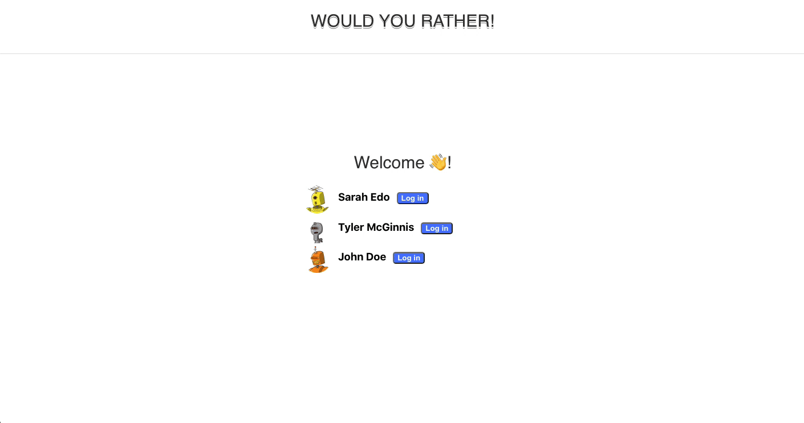
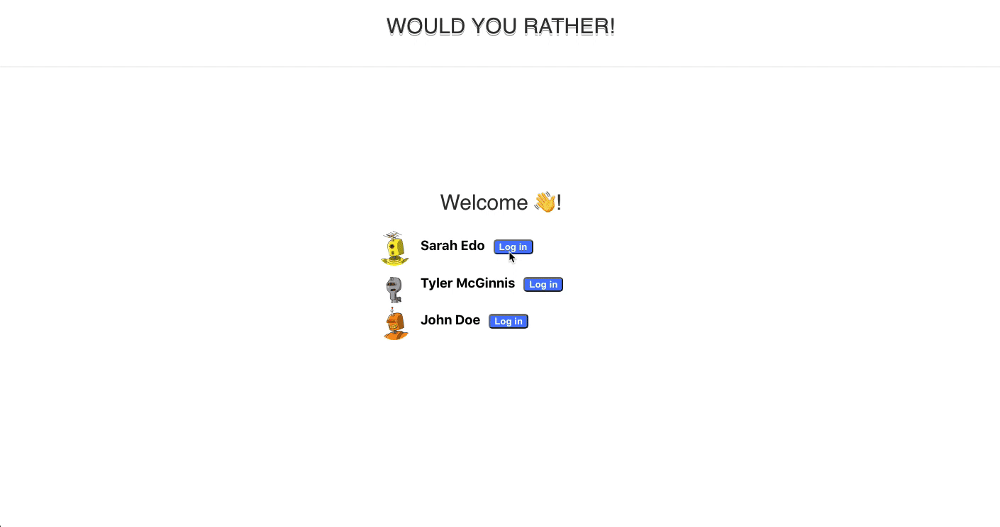
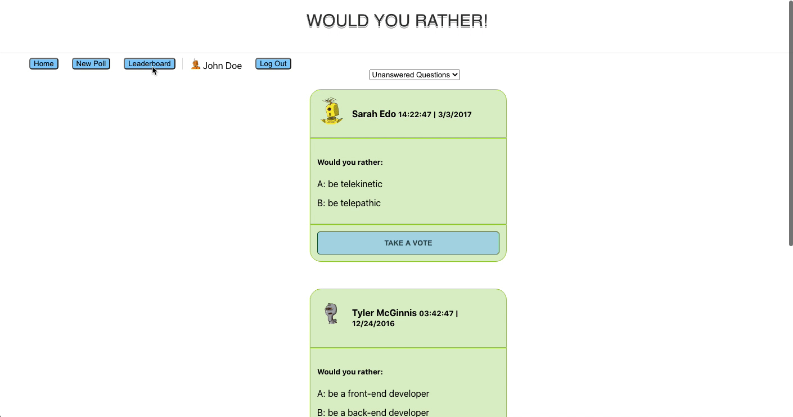
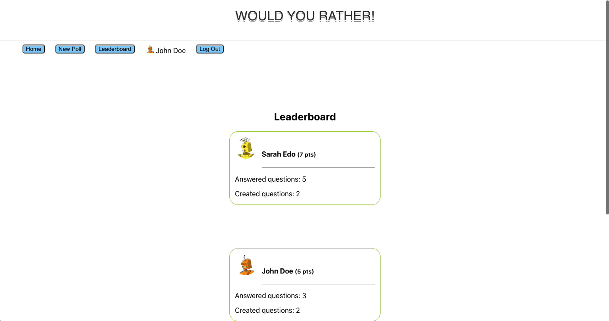

# Would-you-rather-

This Project user can create poll and user can vote on the polls. Also the user has the functionality for creating there own polls.

##### Installation
- git clone https://github.com/Mayuresh12/Would-you-rather-.git
- cd would_you_rather
- npm install
- npm start

## Tools used
- Visual Studio Code
- React.js
- Redux
- Git

###### App Demo

- User can Login.

- User can vote on poll posted.

- Leaderboard for users vote.

- User can create new polls.
